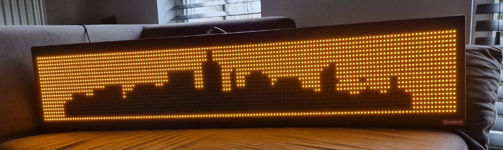

# hanover-led-display
Show all kind of data or pictures on a Hanover LED display via RS485

https://github.com/user-attachments/assets/dce5968c-231f-400c-a54e-3ffc3f423e9a

Some time ago I bought a Hanover display (that was meant to be used as a bus display). I also have a flipdot bus display, but this one is the LED version.

Some more details about my setup:
- Resolution: 144x19 pixels (amber leds)
- Address: when you open the display at the back, you can see the motherboard and there are normally dials on it to set the address. Mine was having dipswitches. Set mine to 1 (which means later on that the address will be 2, as 1 is to be added)
- Looked at many repositories, but the one that worked for me was the pyflipdot-0.2.2
- Bought a RS485 USB connector (mine was a version with a long cable and crocodile clips)
- On my pc I installed the latest version of Python (3.13.1)
- Some Python modules that I installed to get this working (pip, numpy, paho-mqtt, pillow, pyflipdot, pyserial, smmap)

I first connected the red and black communication cables that came out of the Hanover to the USB485 adapter (red to red, black to black). Furthermore, the LED display itself must be connected to the power supply (mine 24V - 2A).

Then it's time to start the display via several python codes:
- First is a simple text (hantext.py), where text is converted to an image. This requires a font to be loaded (I downloaded the hanover-11x19.ttf font, because it fitted easily with my display).
- Second code is a mqtt client version. This let the screen be updated when a new message arrives in the MQTT server. I use that mostly to link to my Home Assistant MQTT broker, where I can easily include sensor-data. An example sent from Home Assistant: payload: "Water: {{ ((states('sensor.water_dagelijks_verbruik') | default(0)) | float * 1000) | round(0) }}L"
- Third one is the conversion of a picture. I used a black and white picture of a skyline, which was visually only very roughly like the dimensions of the Hanover display. The picture (skyline.jpg) was 628x194 pixels. This is then converted to the 144x19 dimensions. 

Also converted the code to work with a Raspberry Pi 4b. For this, some steps were needed (at least in my setup and to be able to display text, images and use mqtt):
- In RPI start terminal
- Make a directory under Downloads and name that hanover2 (or any other name) and go to that directory
- python3 -m venv flipdot_env
- Source flipdot_env/bin/activate
- Pip install pyflipdot <<takes some time but installs numpy, pyserial and pyflipdot>>
- python3 -m pip install Pillow
- pip install paho-mqtt

The codes for RPI are:
- rpitext.py; same as above for my pc version
- rpimqtt2lines.py; slightly changed version to the pc version. This looks at the received mqtt message, when 2 lines are received, the smaller font (hanover6x8.ttf) is used. When 1 line is received the bigger font is displayed (hanover-11x19.ttf).
- rpipicture.py; same as above
- rpi.py; more enhanced program. Can use emoji-icons (when saved in a subdirectory 'emoji_icons' and in bmp format, some examples added), converts pictures to the sign height, both can be used with text (that either is shown in one line or split in two when text is too long). For the emojis the format of the mqtt message should be [icon-name]. So when the emoji 'joy' is needed the input should be [joy] and refers then to the file \emoji_icons\joy.bmp. Pictures should be between < >, so when the mqtt message contains <picture.png> it automatically converts the picture.png in the same directory. Text should be put in as plain text. Example mqtt message: <logo.png> [angry] Hello World will result in the converted picture followed by the angry emoji and after that the text Hello World.
By using mqtt, I managed to get Home Assistant data easily displayed on the screen. Some example YAML code (to display the icon of water followed by the daily usage and the daily costs can be found in the Home Assistant YAML example file.
